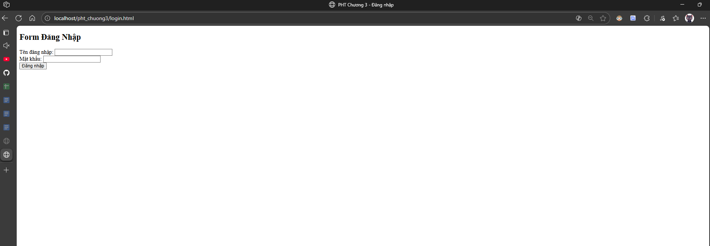
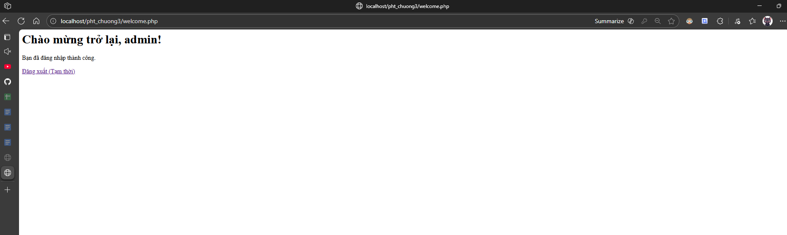
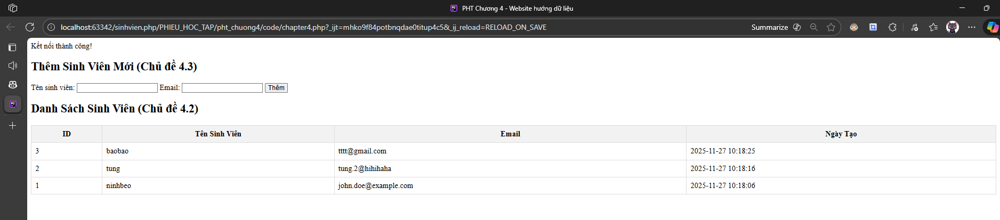

# 📘 Báo Cáo Bài Tập - Môn Công Nghệ Web


## 🎓 Thông Tin Sinh Viên

| Thông tin | Chi tiết |
|:---|:---|
| **Họ và tên** | Ngô Quang Tùng |
| **Mã sinh viên** | 2351170631 |
| **Lớp** | 65KTPM |
| **Môn học** | Công nghệ Web |
| **Giảng viên** | ThS. Tạ Chí Hiếu |

---

## 📖 Giới Thiệu

Repository này được sử dụng để lưu trữ và nộp các bài tập của môn **Công nghệ Web**. Bao gồm các Phiếu học tập (Learning Worksheets), bài tập thực hành trên lớp và các bài kiểm tra trong suốt quá trình học.

---

## 📂 Cấu Trúc Thư Mục

```
CNWeb/
├── PHIEU_HOC_TAP/          # Phiếu học tập
│   ├── pht_chuong1.pdf     # Chương 1: Tổng quan Web
│   ├── pht_chuong2/        # Chương 2: Cơ bản PHP
│   ├── pht_chuong3/        # Chương 3: Trang Web động
│   ├── pht_chuong4/        # Chương 4: Tích hợp CSDL
│   ├── pht_chuong5/        # Chương 5: Mô hình MVC
│   │   └── code/
│   │       ├── index.php
│   │       ├── models/
│   │       │   └── SinhVienModel.php
│   │       └── views/
│   │           └── sinhvien_view.php
│   └── image/              # Ảnh minh họa
├── BT_LOP/                 # Bài tập trên lớp
│   └── test_gia_lap_csdl/  # Bài kiểm tra giả lập CSDL
└── README.md
```

---

## 📚 Nội Dung Bài Tập Theo Chương

| Chương | Chủ đề | Nội dung chính | Trạng thái |
|:---|:---|:---|:---|
| **Chương 1** | Tổng quan Web | Mô hình Client-Server, Giao thức HTTP, Cài đặt Web Server (XAMPP/Laragon) | ✅ Hoàn thành |
| **Chương 2** | Cơ bản PHP | Cú pháp, Biến, Kiểu dữ liệu, Mảng, Cấu trúc điều khiển, Hàm | ✅ Hoàn thành |
| **Chương 3** | Trang Web động | Xử lý Form (`$_POST`/`$_GET`), Quản lý trạng thái (`$_SESSION`, Cookies) | ✅ Hoàn thành |
| **Chương 4** | Tích hợp CSDL | MySQL, PDO, Thao tác CRUD, Kết nối Database | ✅ Hoàn thành |
| **Chương 5** | Mô hình MVC | Model-View-Controller, Tách biệt logic, Quản lý Sinh viên | ✅ Hoàn thành |

---

## 🏫 Bài Tập Trên Lớp

| Thư mục | Mô tả |
|:---|:---|
| `test_gia_lap_csdl` | Bài kiểm tra giả lập cơ sở dữ liệu |

---

## 🛠️ Hướng Dẫn Cài Đặt

1. **Clone Repository:**
   ```bash
   git clone https://github.com/TungCorn/CNWeb.git
   ```

2. **Di chuyển vào thư mục Server:**
    - **XAMPP:** `C:\xampp\htdocs\`
    - **Laragon:** `C:\laragon\www\`

3.  **Khởi động Server:**
- Mở XAMPP/Laragon Control Panel
- Khởi động **Apache**
- Khởi động **MySQL** (cho các bài tập Chương 4, 5)

---

## 🚀 Hướng Dẫn Truy Cập

Truy cập các bài tập qua trình duyệt với đường dẫn:

`http://localhost/CNWeb/[Thư_mục]/[tên_file.php]`

**Ví dụ:**
- **Phiếu học tập Chương 2:** `http://localhost/CNWeb/PHIEU_HOC_TAP/pht_chuong2/index.php`
- **Phiếu học tập Chương 3:** `http://localhost/CNWeb/PHIEU_HOC_TAP/pht_chuong3/login.html`
- **Phiếu học tập Chương 4:** `http://localhost/CNWeb/PHIEU_HOC_TAP/pht_chuong4/index.php`
- **Phiếu học tập Chương 5:** `http://localhost/CNWeb/PHIEU_HOC_TAP/pht_chuong5/code/index.php`
- **Bài tập lớp:** `http://localhost/CNWeb/BT_LOP/test_gia_lap_csdl/index.php`

---

## 📸 Hình Ảnh Minh Họa

<details>
<summary>📌 Demo Chương 2</summary>

> **Demo:**
> 

</details>

<details>
<summary>📌 Demo Chương 3</summary>

> **Giao diện Form Đăng nhập:**
> 
>
> **Trang Chào mừng (Session Active):**
> 

</details>

<details>
<summary>📌 Demo Chương 4</summary>

> **Form:**
> 
>
> **CSDL:**
> 

</details>

<details>
<summary>📌 Demo Chương 5</summary>

> **Quản lý Sinh viên (MVC):**
> 

</details>

---

## 📝 Lời Cảm Ơn

- Tài liệu và bài tập được cung cấp bởi **Trường Đại học Thủy Lợi**
- Hướng dẫn bởi giảng viên **ThS. Tạ Chí Hiếu**

---

*Repository được duy trì bởi Ngô Quang Tùng - MSSV: 2351170631*
