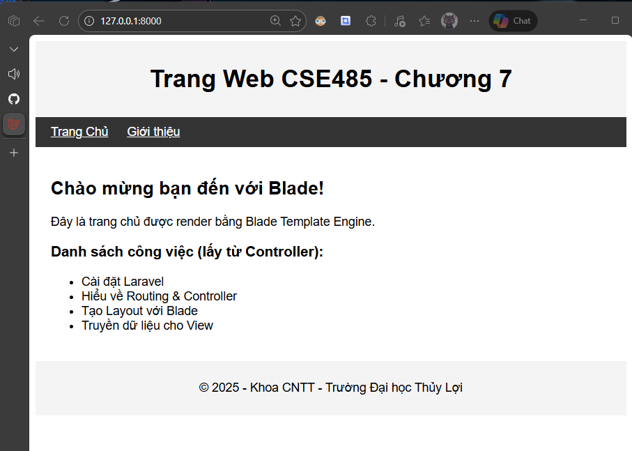
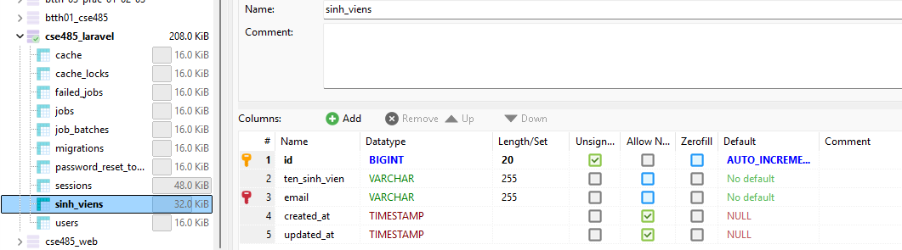
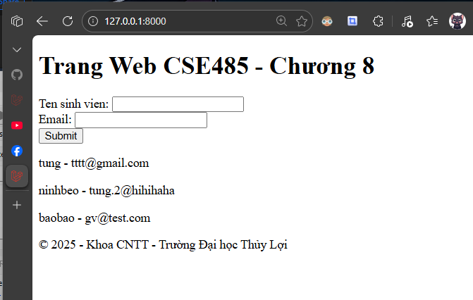
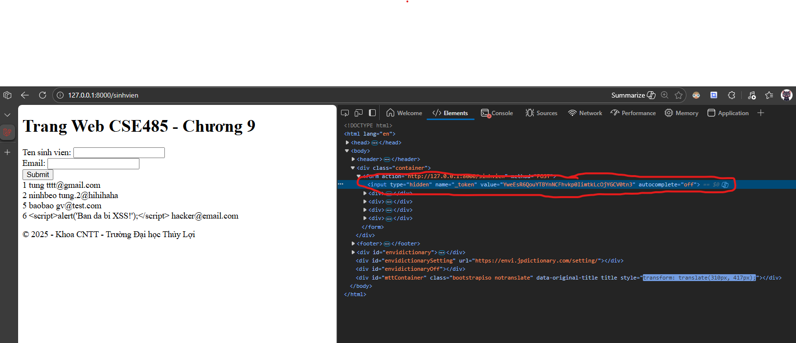
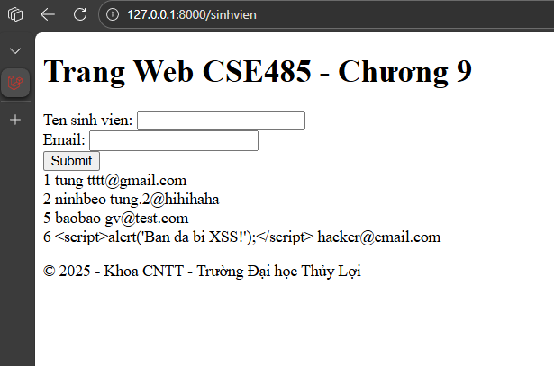

# 📘 Báo Cáo Bài Tập - Môn Công Nghệ Web


---

## 📖 Giới Thiệu

Repository này được sử dụng để lưu trữ và nộp các bài tập của môn **Công nghệ Web**. Bao gồm các Phiếu học tập (Learning Worksheets), bài tập thực hành trên lớp và các bài kiểm tra trong suốt quá trình học.

---

## 📂 Cấu Trúc Thư Mục

```
CNWeb/
├── PHIEU_HOC_TAP/              # Phiếu học tập
│   ├── pht_chuong1.pdf         # Chương 1: Tổng quan Web
│   ├── pht_chuong2/            # Chương 2: Cơ bản PHP
│   ├── pht_chuong3/            # Chương 3: Trang Web động
│   ├── pht_chuong4/            # Chương 4: Tích hợp CSDL
│   ├── pht_chuong5/            # Chương 5: Mô hình MVC
│   ├── pht_chuong6/            # Chương 6: Laravel Framework
│   ├── pht_chuong7/            # Chương 7: Laravel Blade & Layout
│   ├── pht_chuong8/            # Chương 8: Laravel Model & Migration
│   ├── pht_chuong9/            # Chương 9: Bảo mật Web
│   └── image/                  # Ảnh minh họa
│
├── BT_LOP/                     # Bài tập trên lớp
│   ├── test_gia_lap_csdl/      # Bài kiểm tra giả lập CSDL
│   └── lr-project/             # Bài 6. Laravel Framework
│
├── ThucHanh/                   # 📌 Bài thực hành trên lớp
│   ├── BTTH_1/                 # Thực hành 1: Cơ bản PHP
│   │
│   ├── BTTH_2_Nhom/            # 🎓 Thực hành 2 (Nhóm): Hệ thống Quản lý Khóa học Online
│   │
│   └── BTTH_3/                 # 🚀 Thực hành 3: Laravel Framework
│       └── PRAC_01/            # Hệ thống quản lý Thuốc (Medicine)
│           ├── Models/         # Eloquent Models
│           ├── migrations/     # Database Migrations
│           └── seeders/        # Database Seeders
│
│   └── BTTH_4/                 # 🛠️ Thực hành 4: Laravel Framework
│       └── Computer-Issues/    # Hệ thống quản lý Vấn đề Phòng máy
│
└── README.md
```

---

## 📚 Nội Dung Bài Tập Theo Chương

| Chương | Chủ đề | Nội dung chính | Trạng thái |
|:---|:---|:---|:---|
| **Chương 1** | Tổng quan Web | Mô hình Client-Server, Giao thức HTTP, Cài đặt Web Server (XAMPP/Laragon) | ✅ Hoàn thành |
| **Chương 2** | Cơ bản PHP | Cú pháp, Biến, Kiểu dữ liệu, Mảng, Cấu trúc điều khiển, Hàm | ✅ Hoàn thành |
| **Chương 3** | Trang Web động | Xử lý Form (`$_POST`/`$_GET`), Quản lý trạng thái (`$_SESSION`, Cookies) | ✅ Hoàn thành |
| **Chương 4** | Tích hợp CSDL | MySQL, PDO, Thao tác CRUD, Kết nối Database | ✅ Hoàn thành |
| **Chương 5** | Mô hình MVC | Model-View-Controller, Tách biệt logic, Quản lý Sinh viên | ✅ Hoàn thành |
| **Chương 6** | Laravel Framework | Cài đặt Laravel, Routing, Controllers | ✅ Hoàn thành |
| **Chương 7** | Laravel Framework | Blade Templates, Layouts, Views | ✅ Hoàn thành |
| **Chương 8** | Laravel Framework | Eloquent ORM, Migrations, CRUD | ✅ Hoàn thành |
| **Chương 9** | Bảo mật Web | CSRF Protection, XSS Prevention | ✅ Hoàn thành |

---

## 🏫 Bài Tập Trên Lớp

| Thư mục | Mô tả |
|:---|:---|
| `test_gia_lap_csdl` | Bài kiểm tra giả lập cơ sở dữ liệu |
| `lr-project` | Bài 6. Laravel Framework |

---

## � Bài Thực Hành

### 📘 BTTH_1 - Thực hành PHP Cơ bản
Bài tập thực hành các kiến thức nền tảng của PHP.

| Bài | Nội dung |
|:---|:---|
| **B1** | PHP cơ bản |
| **B2** | Xử lý form |
| **B3** | Mảng và vòng lặp |
| **B4** | Dự án tổng hợp |

---

### 🎓 BTTH_2_Nhom - Hệ thống Quản lý Khóa học Online
> **Bài tập nhóm:** Xây dựng hệ thống LMS (Learning Management System) hoàn chỉnh.

**🛠️ Công nghệ sử dụng:**
- PHP thuần (MVC Pattern)
- MySQL Database
- Bootstrap 5 + CSS3
- JavaScript

**📋 Các module chính:**

| Module | Chức năng |
|:---|:---|
| **Auth** | Đăng ký, Đăng nhập, Đăng xuất, Quản lý Session |
| **Course** | Xem danh sách khóa học, Chi tiết, Tìm kiếm |
| **Student** | Dashboard, Ghi danh, Tiến độ học tập, Xem bài giảng |
| **Instructor** | Quản lý khóa học, Bài học, Tài liệu, Danh sách học viên |
| **Admin** | Quản lý Users, Categories, Duyệt khóa học, Thống kê |

**🏗️ Kiến trúc:**
- **Controllers:** Xử lý logic và điều hướng request
- **Models:** Tương tác Database (PDO)
- **ViewModels:** Validation attributes, Data binding
- **Views:** Templates với Bootstrap
- **Router:** Routing URL pattern matching

---

### 🚀 BTTH_3 - Laravel Framework
> **Thực hành với Laravel:** Sử dụng Eloquent ORM để quản lý database.

**📦 PRAC_01 - Quản lý Thuốc (Pharmacy System)**

| Thành phần | Mô tả |
|:---|:---|
| **Models** | `Medicine`, `Sale` - Eloquent Models |
| **Migrations** | Định nghĩa schema: `medicines`, `sales` tables |
| **Seeders** | Dữ liệu mẫu cho testing |

**Database Schema:**
```php
// medicines table
- medicine_id (PK)
- name, brand, dosage, form
- price, stock

- sale_id (PK)
- medicine_id (FK)
- quantity, sale_date, total_amount
```

---

### 🛠️ BTTH_4 - Laravel Framework (Tiếp theo)
> **Thực hành với Laravel:** Xây dựng hệ thống quản lý sự cố máy tính.

**💻 Computer Issues Management System**

| Thành phần | Mô tả |
|:---|:---|
| **Models** | `Computer`, `Issue` - Quan hệ 1-n (Một máy tính có nhiều sự cố) |
| **Migrations** | Tạo bảng `computers` và `issues` |
| **Controllers** | `IssueController` - Quản lý CRUD cho các sự cố báo cáo |

**Database Schema:**
```php
// computers table
- id (PK)
- computer_name, model, operating_system
- processor, memory, available (boolean)

// issues table
- id (PK)
- computer_id (FK)
- reported_by, reported_date
- description, urgency (Low/Medium/High)
- status (Open/In Progress/Resolved)
```

---

## �🛠️ Hướng Dẫn Cài Đặt

1. **Clone Repository:**
   ```bash
   git clone https://github.com/TungCorn/CNWeb.git
   ```

2. **Di chuyển vào thư mục Server:**
    - **XAMPP:** `C:\xampp\htdocs\`
    - **Laragon:** `C:\laragon\www\`

3.  **Khởi động Server:**
- Mở XAMPP/Laragon Control Panel
- Khởi động **Apache**
- Khởi động **MySQL** (cho các bài tập Chương 4, 5)

---

## 🚀 Hướng Dẫn Truy Cập

Truy cập các bài tập qua trình duyệt với đường dẫn:

`http://localhost/CNWeb/[Thư_mục]/[tên_file.php]`

**Ví dụ:**

📚 **Phiếu học tập:**
- **Chương 2:** `http://localhost/CNWeb/PHIEU_HOC_TAP/pht_chuong2/index.php`
- **Chương 3:** `http://localhost/CNWeb/PHIEU_HOC_TAP/pht_chuong3/login.html`
- **Chương 4:** `http://localhost/CNWeb/PHIEU_HOC_TAP/pht_chuong4/index.php`
- **Chương 5:** `http://localhost/CNWeb/PHIEU_HOC_TAP/pht_chuong5/code/index.php`
- **Chương 6:** `http://localhost/CNWeb/PHIEU_HOC_TAP/pht_chuong6/code/web.php`
- **Chương 7:** `http://localhost/CNWeb/PHIEU_HOC_TAP/pht_chuong7/code/homepage.blade.php`
- **Chương 8:** `http://localhost/CNWeb/PHIEU_HOC_TAP/pht_chuong8/code/web.php`
- **Chương 9:** `http://localhost/CNWeb/PHIEU_HOC_TAP/pht_chuong9/code/list.blade.php`

📝 **Bài tập lớp:**
- **Test CSDL:** `http://localhost/CNWeb/BT_LOP/test_gia_lap_csdl/index.php`
- **Laravel Project:** `http://localhost/CNWeb/BT_LOP/lr-project/public/`

💻 **Bài thực hành:**
- **BTTH_1:** `http://localhost/CNWeb/ThucHanh/BTTH_1/B1/index.php`
- **BTTH_3 (Medicines):** `http://localhost/CNWeb/ThucHanh/BTTH_3/PRAC_01/public/`
- **BTTH_4 (Issues):** `http://localhost/CNWeb/ThucHanh/BTTH_4/public/issues`
- **BTTH_2 (LMS):** `http://localhost/CNWeb/ThucHanh/BTTH_2_Nhom/`
  - Trang chủ: `/home`
  - Đăng nhập: `/auth/login`
  - Khóa học: `/courses`
  - Dashboard Instructor: `/instructor/dashboard`
  - Dashboard Admin: `/admin/dashboard`

---

## 📸 Hình Ảnh Minh Họa

<details>
<summary>📌 Demo Chương 2</summary>

> **Demo:**
> 

</details>

<details>
<summary>📌 Demo Chương 3</summary>

> **Giao diện Form Đăng nhập:**
> 
>
> **Trang Chào mừng (Session Active):**
> 

</details>

<details>
<summary>📌 Demo Chương 4</summary>

> **Form:**
> 
>
> **CSDL:**
> 

</details>

<details>
<summary>📌 Demo Chương 5</summary>

> **Quản lý Sinh viên (MVC):**
> 

</details>

<details>
<summary>📌 Demo Chương 6</summary>

> **GIỚI THIỆU VỀ LARAVEL:**
> 

</details>

<details>
<summary>📌 Demo Chương 7</summary>

> **Laravel Blade Views:**
> 

</details>

<details>
<summary>📌 Demo Chương 8</summary>

> **Data:**
> 
>
> **Form Thêm mới:**
> 

</details>

<details>
<summary>📌 Demo Chương 9</summary>

> **CSRF Protection:**
> 
>
> **XSS Prevention:**
> 

</details>

---

## 📝 Lời Cảm Ơn

- Tài liệu và bài tập được cung cấp bởi **Trường Đại học Thủy Lợi**
- Hướng dẫn bởi giảng viên **ThS. Tạ Chí Hiếu**

---

*Repository được duy trì bởi Ngô Quang Tùng*
